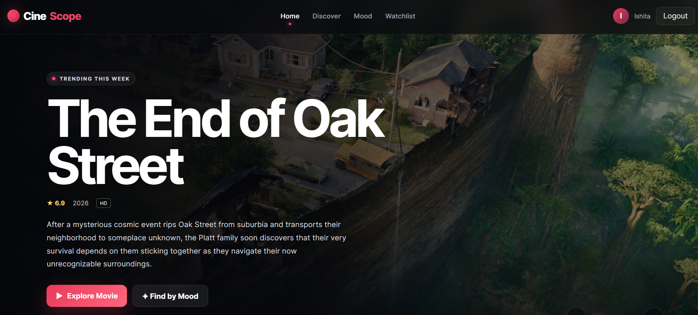
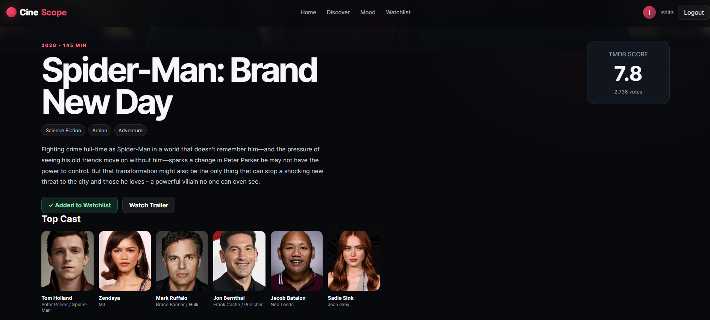
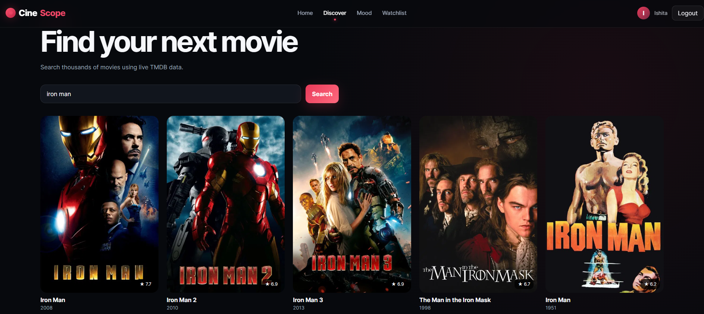
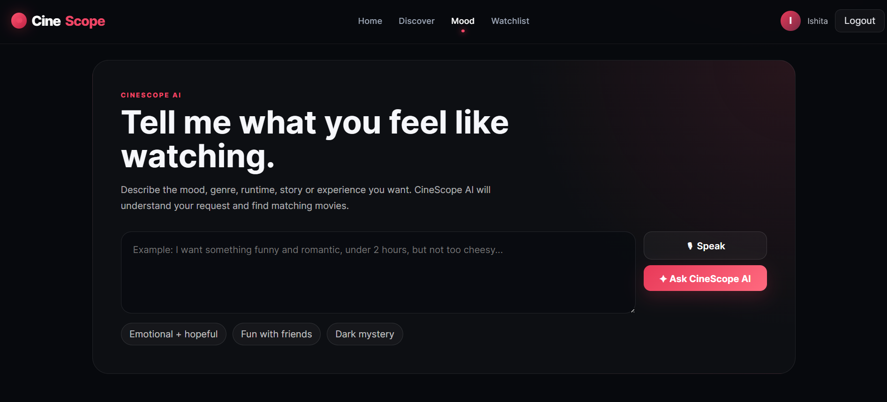
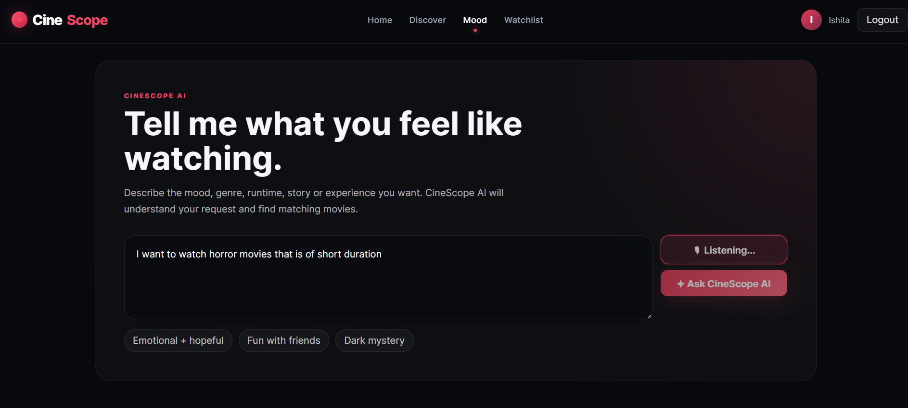
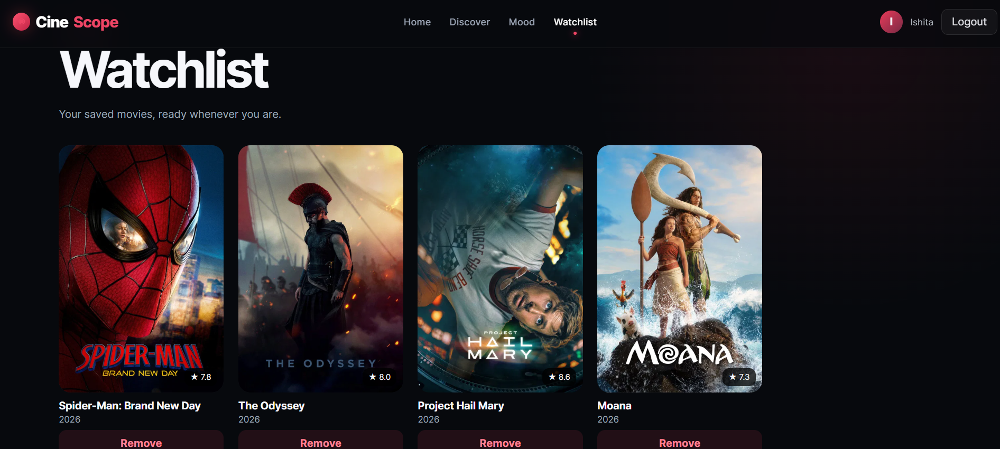

# 🎬 CineScope – Movie Discovery & AI Recommendation Platform

CineScope is a full-stack movie discovery and review platform that helps users explore movies, maintain personal watchlists, write reviews, discover movies based on their mood, and receive personalized recommendations using an AI-powered assistant.

The platform combines real-time movie data from TMDB with Groq-powered natural-language understanding to provide a more personalized movie discovery experience.

🌐 **Live Demo:**  
https://cine-scope-wheat-kappa.vercel.app

---

## ✨ Features

### 🎥 Movie Discovery

- Browse trending movies
- Explore popular movies
- View top-rated movies
- Search for movies by title
- View detailed movie information
- Explore movie posters and backdrops
- View cast information
- Watch available trailers
- View ratings and release information

### 🎞 Cinematic Home Experience

- Dynamic hero section using trending movies
- Automatic hero carousel
- Manual carousel navigation
- Movie backdrop images
- Direct navigation to movie details
- Responsive cinematic interface

### 🔐 User Authentication

Users can create their own CineScope account.

Features include:

- User registration
- Secure login
- JWT-based authentication
- Password hashing using bcrypt
- Protected user functionality

### ❤️ Personal Watchlist

Logged-in users can:

- Add movies to their watchlist
- Remove movies from their watchlist
- View saved movies
- View movie ratings inside the watchlist
- Maintain their watchlist across sessions

Watchlist information is stored using MongoDB.

### ⭐ Ratings & Reviews

Users can:

- Rate movies
- Write reviews
- View previously submitted reviews
- Store reviews persistently in the database

### 🎭 Mood-Based Movie Discovery

CineScope provides a dedicated mood discovery system that allows users to find movies according to how they feel.

Available moods include:

- 😂 Something Funny
- 🧠 Make Me Think
- ✨ Feel-Good
- 🔥 Something Intense
- 🥹 Emotional
- 🌙 Late-Night Comfort

Each mood is dynamically mapped to appropriate TMDB genres and rating criteria.

---

## 🤖 AI-Powered Movie Recommendation Assistant

One of CineScope's main features is its natural-language AI movie recommendation assistant.

Instead of manually selecting filters, users can describe what they want to watch in everyday language.

For example:

> "I want a funny adventure movie that isn't too long."

or:

> "Suggest an emotional science-fiction movie with a good rating."

CineScope sends the request to Groq AI, which interprets the user's preferences and extracts information such as:

- Mood
- Preferred genres
- Maximum runtime
- Minimum rating
- Important themes
- Content the user wants to avoid

These preferences are then converted into TMDB discovery filters and used to retrieve real movies.

### AI Recommendation Flow

```text
User Request
     ↓
Groq AI
     ↓
Preference Extraction
     ↓
Mood / Genre / Runtime / Rating
     ↓
TMDB Discover API
     ↓
Personalized Movie Recommendations
```

This approach allows the AI to understand the user's request while TMDB remains responsible for retrieving actual movie data.

---

## 🎙️ Voice-Powered Movie Recommendations

CineScope also supports voice input for AI recommendations.

Users can click the **Speak** button and describe the type of movie they want instead of typing it manually.

### Voice Recommendation Flow

```text
User Voice
    ↓
Browser Speech Recognition
    ↓
Speech-to-Text
    ↓
Groq AI
    ↓
Preference Analysis
    ↓
TMDB API
    ↓
Movie Recommendations
```

The recognized speech is displayed in the input field before the recommendation request is submitted.

Voice recognition support may vary depending on the browser.

---

## 🧠 What Makes CineScope Different?

Traditional movie discovery platforms usually depend on search bars, genres, or predefined filters.

CineScope adds multiple discovery approaches:

```text
Traditional Search
       +
Mood-Based Discovery
       +
Natural-Language AI Recommendations
       +
Voice-Based Movie Requests
```

This allows users to search based not only on a movie title, but also on **what they actually feel like watching**.

---

## 🛠️ Tech Stack

### Frontend

- React
- JavaScript
- HTML5
- CSS3
- Vite
- Axios
- React Router

### Backend

- Node.js
- Express.js
- REST API
- JWT Authentication
- bcrypt

### Database

- MongoDB Atlas
- Mongoose

### APIs & AI

- TMDB API
- Groq AI
- Browser Web Speech API

### Deployment

- Vercel – Frontend
- Render – Backend
- MongoDB Atlas – Cloud Database

---

## 🏗️ Project Architecture

```text
                         ┌──────────────────┐
                         │      USER        │
                         └────────┬─────────┘
                                  │
                                  ▼
                         ┌──────────────────┐
                         │  React Frontend  │
                         │     Vercel       │
                         └────────┬─────────┘
                                  │
                              REST API
                                  │
                                  ▼
                         ┌──────────────────┐
                         │ Node + Express   │
                         │     Render       │
                         └───────┬──────────┘
                                 │
                ┌────────────────┼────────────────┐
                │                │                │
                ▼                ▼                ▼
         ┌────────────┐    ┌────────────┐   ┌────────────┐
         │ MongoDB    │    │ TMDB API   │   │ Groq AI    │
         │ Atlas      │    │            │   │            │
         └────────────┘    └────────────┘   └────────────┘
```

---

## 📁 Project Structure

```text
cinescope/
│
├── client/
│   ├── src/
│   │   ├── components/
│   │   ├── context/
│   │   ├── pages/
│   │   ├── services/
│   │   ├── App.jsx
│   │   ├── main.jsx
│   │   └── styles.css
│   │
│   ├── package.json
│   └── vite.config.js
│
├── server/
│   ├── src/
│   │   ├── config/
│   │   ├── middleware/
│   │   ├── models/
│   │   ├── routes/
│   │   └── index.js
│   │
│   └── package.json
│
├── .gitignore
└── README.md
```

---

## ⚙️ Local Installation

### 1. Clone the repository

```bash
git clone https://github.com/ishitadeb23-jpg/CineScope.git
```

Move into the project:

```bash
cd CineScope
```

---

### 2. Install Backend Dependencies

```bash
cd server
npm install
```

Create:

```text
server/.env
```

Add:

```env
PORT=5000
MONGODB_URI=your_mongodb_connection_string
JWT_SECRET=your_jwt_secret
TMDB_BEARER_TOKEN=your_tmdb_read_access_token
GROQ_API_KEY=your_groq_api_key
CLIENT_URL=http://localhost:5173
```

Start the backend:

```bash
npm run dev
```

The backend should run on:

```text
http://localhost:5000
```

---

### 3. Install Frontend Dependencies

Open another terminal:

```bash
cd client
npm install
```

Create:

```text
client/.env
```

Add:

```env
VITE_API_BASE_URL=http://localhost:5000/api
```

Start the frontend:

```bash
npm run dev
```

Open:

```text
http://localhost:5173
```

---

## 🔑 Environment Variables

The project requires the following environment variables.

### Backend

```env
PORT=
MONGODB_URI=
JWT_SECRET=
TMDB_BEARER_TOKEN=
GROQ_API_KEY=
CLIENT_URL=
```

### Frontend

```env
VITE_API_BASE_URL=
```

> ⚠️ API keys, database credentials, JWT secrets, and `.env` files should never be committed to GitHub.

---

## 🌐 API Overview

CineScope's Express backend provides routes for:

```text
/api/auth
/api/movies
/api/watchlist
/api/reviews
/api/recommendations
```

### Movie Routes

Used for:

- Trending movies
- Popular movies
- Top-rated movies
- Movie search
- Movie details
- Mood discovery

### Authentication Routes

Used for:

- User registration
- User login
- Authentication

### Watchlist Routes

Used for:

- Retrieving a user's watchlist
- Adding movies
- Removing movies

### Review Routes

Used for:

- Retrieving reviews
- Creating and storing movie reviews

### AI Recommendation Routes

Used for:

- Processing natural-language movie requests
- Extracting user preferences with Groq AI
- Retrieving matching movies through TMDB

---

## 🔒 Security

CineScope implements several security practices:

- Password hashing with bcrypt
- JWT-based authentication
- Environment variables for sensitive credentials
- Protected backend routes
- CORS configuration for frontend/backend communication
- MongoDB authentication
- API keys kept outside the source code

---

## 🚀 Deployment Architecture

### Frontend

Hosted on **Vercel**

https://cine-scope-wheat-kappa.vercel.app

### Backend

Hosted on **Render**

https://cinescope-1-na1x.onrender.com

### Database

Hosted using **MongoDB Atlas**

---

## 📸 Screenshots

### 🎬 Home Page



### 🎥 Movie Details



### 🎭 Mood-Based Discovery



### 🤖 AI Movie Recommendation Assistant



### 🎙️ Voice Recommendation



### ❤️ Personal Watchlist



---

## 🔮 Future Improvements

Possible future enhancements include:

- User profile pages
- More advanced recommendation personalization
- Recommendation history
- Improved multilingual voice recognition
- Social movie lists
- Friend-based recommendations
- Streaming-provider availability
- Advanced movie filtering
- Improved review interactions

---

## 🎯 Project Purpose

CineScope was developed as a full-stack project to explore the integration of modern web development, external APIs, databases, authentication, and generative AI.

The project demonstrates practical experience with:

- Full-stack application development
- REST API development
- Third-party API integration
- AI API integration
- Database design
- Authentication and authorization
- Responsive UI development
- Cloud deployment
- Natural-language interfaces
- Voice-enabled web interactions

---

## 👩‍💻 Developer

**Ishita Deb**

B.Tech – Computer Science & Engineering

GitHub:  
https://github.com/ishitadeb23-jpg

Portfolio:  
https://ishitadeb23-jpg.github.io/

---

## ⭐ Support

If you found CineScope interesting, consider giving the repository a ⭐.

---

### 🎬 Discover movies based on more than just their title — discover what fits your mood.